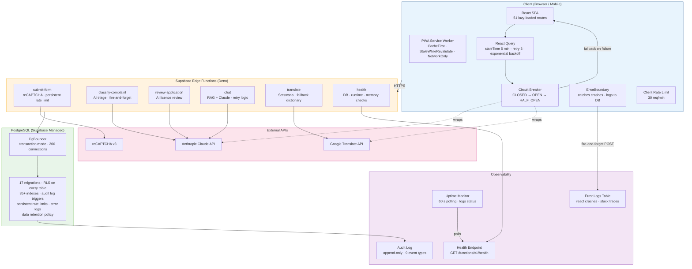

# BOCRA Platform — System Architecture

## Stack

| Layer | Technology | Why |
|-------|-----------|-----|
| Frontend | React 18 + Vite + Tailwind CSS | SPA with lazy loading, PWA offline support |
| Backend | Supabase (Postgres + Auth + Edge Functions) | Managed, auto-scaling, built-in RLS |
| AI | Anthropic Claude API | Complaint triage, licence review, chat assistant |
| Hosting | GitHub Pages (demo) → Azure (production) | CDN-ready static deployment |
| i18n | Ternary-based bilingual (EN/Setswana) | Co-located with components for code splitting |

## Architecture Diagram

> **How to read this:** Requests flow top-down from Client → Edge Functions → Database. The circuit breaker (dashed lines) wraps external API calls so that when Anthropic or Google are down, the app serves fallbacks immediately instead of hanging. The Monitoring subgraph shows how errors and health data flow into observable stores.

## Security (Pentest-Driven)

| Layer | Measure | Evidence |
|-------|---------|----------|
| Network | TLS 1.2+1.3, CSP, HSTS (1yr preload) | nginx.conf |
| Input | 3-layer XSS prevention (DOMPurify + HTML strip + server sanitize) | src/lib/security.js, Edge Functions |
| Auth | Server-side role verification from DB (NOT JWT metadata) | src/lib/auth.jsx |
| Data | RLS on every table, sector-scoped access | 17 migrations |
| Rate Limit | 3 tiers: client → nginx → DB-persistent | src/lib/supabase.js, nginx.conf, migration 015 |
| Audit | Immutable append-only log, 5 indexes | migration 004 |
| Privacy | DPA §18 consent on every form, data retention enforcement | ConsentCheckbox.jsx, migration 006 |

## Fault Tolerance

| Failure Scenario | Response |
|-----------------|----------|
| Supabase API down | Public pages serve stale cached data via Service Worker |
| AI API down | Complaints still submit (fire-and-forget classification) |
| Translation API down | Falls back to hardcoded Setswana dictionary |
| React component crash | ErrorBoundary catches, logs to DB, offers retry |
| Network failure | PWA offline mode, offlineFirst query strategy |
| Rate limit exceeded | 429 response at all 3 tiers, persistent DB tracking |
| External API transient error | fetchWithRetry with exponential backoff (3 attempts) |
| Repeated API failures | Circuit breaker opens, serves fallback immediately |

## Scalability

| Layer | Strategy | Capacity |
|-------|----------|----------|
| Frontend | Lazy-loaded routes, PWA cache, CDN-ready | Unlimited (static) |
| Data layer | React Query staleTime 5min, gcTime 30min | ~80% reduction in DB hits |
| Edge Functions | Serverless, auto-scale, independent per function | Scales to zero and up automatically |
| Database | PgBouncer transaction mode, 35+ indexes, composite indexes | 200 pooled connections |
| Rate limiting | 3-tier protection | Survives abuse without degradation |

## Production Migration Path

| Current (Hackathon) | Phase 2 (Production) |
|---------------------|---------------------|
| GitHub Pages | Azure Static Web Apps + Front Door CDN |
| Supabase Edge Functions | Azure Functions (Deno runtime, 1:1 mapping) |
| Supabase Postgres | Azure Database for PostgreSQL Flexible Server |
| PgBouncer (Supabase built-in) | PgBouncer (Azure Flexible Server built-in) |
| Single region | Azure geo-redundant (JHB + CPT) |
| Custom uptime script | Azure Monitor + Application Insights |
| PWA cache | Azure Front Door edge caching |
| ~$25/mo | ~$200-400/mo |
| Estimated migration: 2-3 weeks |
